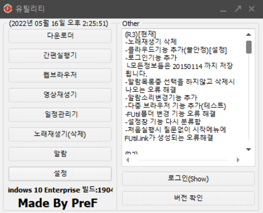
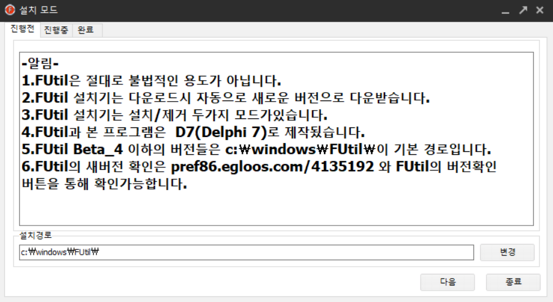
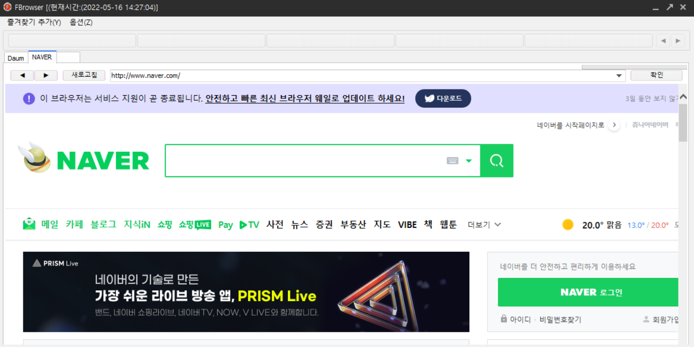
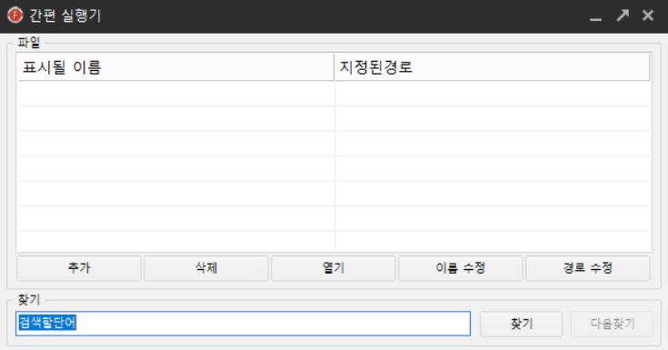
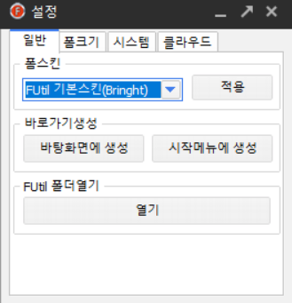

# FUtil

당시 사용중이던 OS(Windows 7)에는 분명 여러가지 편의 기능들이 존재하지만 이런 기능들이 모두 흩어져 있어 실제로 사용하기에는 답답한 느낌이 있었습니다.

이러한 문제를 해결하고자 아래의 기준을 통해 본 프로그램을 개발하게 되었습니다.

1. 내가 자주 사용하는 기능을 모두 추가하자.

2. 모든 기능은 접근하기 쉬웠으면 좋겠다.

3. 사용자가 사용 중인 사용 환경(윈도우 사이즈, 위치, 트레이 아이콘 전환 등)을 유지했으면 좋겠다.

4. 실제 프로그램처럼 있어보이게(설치, 제거 등) 만들어보자.

특히 4번을 지키기 위해 FSetups(설치, 제거), FUtils(유틸리티)를 따로 개발하였고 버전, 프로그램 파일 업로드 등은 이글루스(igloos) 블로그에 파일 업로드 주소가 고정인 점을 활용하여 따로 버전용 서버는 따로 만들지 않았습니다.

# 프로그램 내부 이미지

## 목표
> **2번 목표를 달성하기 위해 실제로 모든 기능에 한번에 접근할 수 있도록 UI 설계**

## FSetups

### 목표

> **4번 목표를 위해 FUtil의 주요 파일들을 설치/ 제거할 수 있도록 하는 프로그램**

### 주요 기능

- 모드 전환 : 프로그램 실행시 매개 변수를 통해 설치, 제거 모드의 전환이 가능하도록 설정

- 버전확인 : 이글루스(igloos)라는 블로그에 버전을 올려 Parsing 기술을 통해 최신 버전과 파일 주소를 불러오는 방식   

- 다운로드 : 버전확인 과정에서 가져온 파일 주소를 통해 FUtil을 다운로드 받는 방식

## 웹브라우저

### 목표

> **제일 많이 사용하는 Internet Explorer을 대체할 수는 없지만 기능을 따라해보고자 하여 기능 구현**

### 주요기능

- 탭 컨트롤 : 동적으로 탭을 생성하여 객체들을 생성하는 방식

- 즐겨찾기 : 즐겨찾는 페이지에 대한 정보들을 저장하여 페이지 수에 맞게 상단에 5개를 띄우는 형식

- 페이지 컨트롤 : 뒤로가기/ 앞으로가기, 새로고침, 페이지 이동 등 구현

## 간편 실행기

### 목표

> **윈도우의 바로가기 파일을 여러 폴더에 따라 분류하게 되면서 너무 많아진 폴더 때문에 파일을 쉽게 찾지 못하게 되었고 이를 쉽게 관리하고자 기능 구현**

### 주요기능

- 파일 존재 유무 감지 : 리스트 내에 해당 파일이 존재하지 않는 경우 해당 라인만 빨간색을 칠하여 사용자에게 해당 파일이 없음을 표현.

- 파일 검색 : UI가 List 형식인 특성상 파일이 한 눈에 보이지 않는 점을 보완하고자 단어 검색 기능을 추가.

## 설정

### 목표

> **3번 목표를 달성하기 위해 사용자가 직접 프로그램을 설정할 수 있도록 설정 기능을 구현**

### 주요기능

- 레지스트리 조작 : 사용자 설정에 관한 설정값을 레지스트리에 저장하는 방식 사용(지금 보면 파일 이용방식을 사용하는게 더 나았을 거 같다..)

- 폼 크기 설정 : 각 폼의 크기를 직접 숫자로 지정하는 방식.

- 시스템 설정 : Tray Icon, 설치 폴더 변경, 시스템 시작 시 프로그램 시작 등에 대한 설정

- 클라우드 설정 : 사용자의 간편 실행기, 알람 등의 리스트 내용을 텍스트 <-> 리스트 로 전환하여 클라우드에 저장/불러오기 기능
